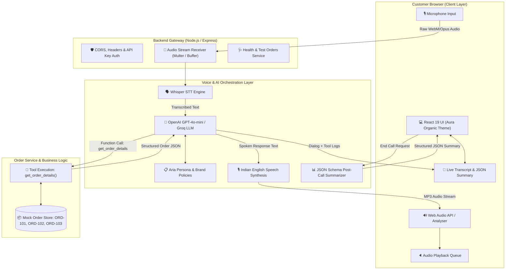

# 🌿 Aura Skincare — AI Voice Customer Support Specialist (Aria)

[](https://www.typescriptlang.org/)
[](https://react.dev/)
[](https://nodejs.org/)
[](https://openai.com/)
[](LICENSE)

An intelligent, production-ready, browser-based AI Voice Customer Support Agent built for **Aura Skincare**, featuring **Aria** — a friendly, professional, and concise Indian Customer Support Specialist.

Built for the **Datastraw Technologies AI + Tech Intern Assessment**.

---

## 📑 Table of Contents
1. [Project Overview](#-1-project-overview)
2. [Key Features](#-2-key-features)
3. [Architecture & System Flow](#-3-architecture--system-flow)
4. [Technology Stack & Rationale](#-4-technology-stack--rationale)
5. [Voice Pipeline Architecture](#-5-voice-pipeline-architecture)
6. [AI Agent Persona & Tone (Aria)](#-6-ai-agent-persona--tone-aria)
7. [Tool / Function Calling (`get_order_details`)](#-7-tool--function-calling-get_order_details)
8. [Aura Skincare Brand Knowledge](#-8-aura-skincare-brand-knowledge)
9. [Strict Policy Guardrails](#-9-strict-policy-guardrails)
10. [Mock Order Database](#-10-mock-order-database)
11. [Real-time Transcript](#-11-real-time-transcript)
12. [Post-Call Structured JSON Summary](#-12-post-call-structured-json-summary)
13. [Local Setup & Installation](#-13-local-setup--installation)
14. [Environment Variables](#-14-environment-variables)
15. [Running the Application](#-15-running-the-application)
16. [Production Deployment](#-16-production-deployment)
17. [Automated & Interactive Testing](#-17-automated--interactive-testing)
18. [Known Limitations](#-18-known-limitations)
19. [Future Improvements](#-19-future-improvements)
20. [Assessment Questions & Answers](#-20-assessment-questions--answers)
21. [Approach Note & Submission Package](#-21-approach-note--submission-package)

---

## 🌟 1. Project Overview
Aura Skincare is a premium organic Indian skincare brand focused on simple, effective skincare products made with thoughtfully selected ingredients.

This application provides a seamless browser-based voice customer support experience. Evaluators can initiate a voice call, speak naturally into their microphone, hear Aria respond in natural spoken English with an Indian customer-support style, query mock orders, test policy guardrails, review a live transcript with tool executions, and inspect a structured JSON call summary upon ending the call.

---

## ✨ 2. Key Features
- **🎙️ True Browser-Based Realtime Voice Conversation**: Direct microphone capture and spoken audio playback with live audio visualizer.
- **⚡ Genuine Tool / Function Calling**: AI autonomously triggers `get_order_details(order_id)` when order tracking or resolution is requested.
- **🛡️ Strict Policy Guardrails**: Enforces exact shipping thresholds (₹499), 7-day return limits, processing-only cancellations, and ₹2,500 COD ceilings. Never makes false promises.
- **🧠 Multi-Turn Context Awareness**: Understands anaphoric references (e.g. *"Where is ORD-101?"* followed by *"Can I cancel it?"*).
- **📜 Live Transcript & Tool Execution Chips**: Displays chronological dialogues and inspection details of executed tool calls.
- **📊 Post-Call Structured JSON Summary**: Generates schema-compliant JSON capturing customer intent, order ID, product, policy referenced, and resolution status.
- **📦 Evaluator Test Orders Helper**: On-screen cards for `ORD-101`, `ORD-102`, and `ORD-103` with 1-click test triggers.
- **🔒 Secure Architecture**: Protects backend API keys and provides a client-side configuration drawer for custom evaluation keys.

---

## 🏛️ 3. Architecture & System Flow

### System Architecture Diagram


---

## 💻 4. Technology Stack & Rationale

| Component | Technology | Rationale |
| :--- | :--- | :--- |
| **Frontend Framework** | React 19 + TypeScript | Declarative state management, fast rendering, type-safe interfaces for audio streams and transcripts. |
| **Build Tool** | Vite 6 | Sub-second hot reloading, optimized ESM bundling, zero configuration overhead. |
| **Styling** | Vanilla Modern CSS (CSS Variables) | Tailored luxury botanical design system (Glassmorphism, emerald tones, animated visualizers) with zero runtime bundle bloat. |
| **Backend Server** | Node.js + Express + TypeScript | Lightweight asynchronous I/O, native streaming support for audio buffers, unified JSON APIs. |
| **AI Model & Reasoning** | OpenAI `gpt-4o-mini` | Sub-500ms token generation latency, reliable function calling adherence, strict JSON mode support. |
| **Speech-to-Text (STT)**| OpenAI Whisper (`whisper-1`) + Web Speech API | High accuracy recognition across diverse Indian accents with native browser streaming fallback. |
| **Text-to-Speech (TTS)**| OpenAI TTS (`tts-1` / `shimmer`) + Web Speech Synthesis (`en-IN`) | Clear, warm, natural female conversational tone with zero-cost browser speech fallback. |
| **Order Data Layer** | In-Memory Normalized Service | Fast, deterministic, zero-infrastructure mock database adhering exactly to evaluation test orders. |

---

## 🎙️ 5. Voice Pipeline Architecture
1. **Audio Capture**: Web Audio API requests user microphone via `navigator.mediaDevices.getUserMedia` with noise suppression and echo cancellation.
2. **Streaming & Voice Activity**: Real-time energy levels are fed into an `AnalyserNode` driving the responsive visualizer.
3. **STT (Speech-to-Text)**: Audio is sent to the backend `/api/voice-turn` or processed via Web Speech API streaming.
4. **AI Reasoning & Tool Invocation**: If order queries are detected, `get_order_details` is invoked in real-time, querying the order database.
5. **TTS (Text-to-Speech)**: The natural spoken response is synthesized into MP3 audio and played via the browser audio output.
6. **State Transitions**: The UI transitions reactively between `Idle`, `Listening`, `Thinking`, `Speaking`, and `Error`.

---

## 👩‍💼 6. AI Agent Persona & Tone (Aria)
- **Name**: Aria
- **Role**: Customer Support Specialist at Aura Skincare
- **Style**: Warm, polite, professional Indian customer-support style.
- **Conciseness**: Answers in 1–3 clear sentences tailored for voice audio; avoids markdown walls or repeated self-introductions.
- **Scope Restriction**: Only handles Aura Skincare products, orders, and policies. Politely refuses out-of-scope inquiries (e.g. flight bookings).

---

## 🔧 7. Tool / Function Calling (`get_order_details`)

### Specification:
```json
{
  "name": "get_order_details",
  "description": "Retrieves live order details, status, shipping courier, delivery timeline, and policy eligibility for an Aura Skincare order ID.",
  "parameters": {
    "type": "object",
    "properties": {
      "order_id": {
        "type": "string",
        "description": "The Aura Skincare order ID (e.g. ORD-101, ORD-102, ORD-103)."
      }
    },
    "required": ["order_id"]
  }
}
```

### Tool Execution Flow:
1. Customer speaks: *"Where is my order ORD-101?"*
2. LLM identifies intent and extracts `order_id: "ORD-101"`.
3. Backend executes `executeGetOrderDetails("ORD-101")`.
4. Returns: `{ found: true, status: "Out for Delivery", courier: "BlueDart", delivery_info: "Expected by 6 PM today" }`.
5. Aria synthesizes spoken response based strictly on returned data.
6. Execution details are rendered as a tool chip in the live transcript.

---

## 📋 8. Aura Skincare Brand Knowledge
- **Brand Identity**: Premium organic Indian skincare brand focusing on pure, gentle, and effective botanical formulations.
- **Shipping Policy**:
  - Free delivery on orders above ₹499.
  - ₹50 flat shipping fee on orders below ₹499.
  - Standard delivery takes 3–5 business days across India.
- **Return & Refund Policy**:
  - Returns accepted strictly within 7 days of delivery.
  - Products must be unopened, unused, and in original packaging.
  - Damaged or defective items must be reported within 48 hours of delivery with photos for replacement.
- **Cancellation Policy**:
  - Orders can be cancelled ONLY while their status is `Processing`.
  - Once an order is `Shipped` or `Out for Delivery`, it CANNOT be cancelled (customers may refuse delivery at the doorstep).
- **Cash on Delivery (COD)**:
  - Available on orders up to ₹2,500.
  - Customers can pay via Cash or UPI at the doorstep.

---

## 🛡️ 9. Strict Policy Guardrails
The agent applies policy reasoning rather than blindly complying:
- **Case A**: Customer asks to cancel `ORD-101` (`Out for Delivery`).
  - *Result*: Aria explains that because the order is out for delivery, it cannot be cancelled per policy, and advises refusing at doorstep.
- **Case B**: Customer asks to return `ORD-102` (Delivered 14 days ago).
  - *Result*: Aria politely informs the customer that the order was delivered 14 days ago, exceeding the 7-day return window.
- **Case C**: Customer asks to cancel `ORD-103` (`Processing`).
  - *Result*: Aria confirms that `ORD-103` is currently processing and eligible for cancellation.

---

## 📦 10. Mock Order Database

| Order ID | Customer Name | Product | Value | Status | Courier / Timeline | Eligibility |
| :--- | :--- | :--- | :--- | :--- | :--- | :--- |
| **ORD-101** | Priya Sharma | Vitamin C Serum (30ml) | ₹699 | `Out for Delivery` | BlueDart (`BD-982103`) • Expected by 6 PM today | Non-cancellable (Out for delivery) |
| **ORD-102** | Rahul Verma | Hydrating Sunscreen SPF 50 | ₹499 | `Delivered` | Delhivery (`DL-441029`) • Delivered 14 days ago | Non-returnable (> 7 days) |
| **ORD-103** | Ananya Patel | Green Tea Face Wash + Toner | ₹850 | `Processing` | Ordered 3 hours ago | **Eligible for cancellation** |

---

## 📜 11. Real-time Transcript
The middle column maintains a live conversation stream:
- **Customer Utterances**: Tagged with timestamps and user avatar.
- **Aria Spoken Responses**: Tagged with timestamps and audio replay button.
- **Tool Execution Logs**: Expandable chips displaying the tool called, arguments passed, and returned data.

---

## 📊 12. Post-Call Structured JSON Summary
When **End Call** is clicked, the backend analyzes the conversation and produces a strict JSON summary:

```json
{
  "customer_intent": "ORDER_TRACKING",
  "order_id": "ORD-101",
  "customer_name": "Priya Sharma",
  "product": "Vitamin C Serum (30ml)",
  "order_status": "Out for Delivery",
  "actions_taken": [
    "Retrieved live order details for ORD-101 via tool",
    "Informed customer that delivery is expected by 6 PM today via BlueDart"
  ],
  "policy_referenced": "Out for delivery cancellation restriction",
  "resolution_status": "RESOLVED",
  "unresolved_reason": null,
  "call_summary": "Customer enquired about the status of ORD-101. Aria confirmed the order is out for delivery with BlueDart and expected by 6 PM today."
}
```

---

## 🛠️ 13. Local Setup & Installation

### Prerequisites:
- Node.js (v18 or higher)
- npm (v9 or higher)

### Clone & Install:
```bash
git clone https://github.com/your-username/datastraw-aura-skincare-voice-agent.git
cd datastraw-aura-skincare-voice-agent

# Install all backend and frontend dependencies
npm --prefix backend install
npm --prefix frontend install
```

---

## 🔑 14. Environment Variables
Create a `.env` file in the root directory:

```env
# Server Configuration
PORT=5000
NODE_ENV=development

# OpenAI API Key (Required for GPT-4o-mini & Whisper/TTS)
OPENAI_API_KEY=sk-proj-your-actual-key-here
OPENAI_MODEL=gpt-4o-mini

# Voice Settings
TTS_VOICE=shimmer
TTS_SPEED=1.0

# Client URL (for CORS)
CLIENT_URL=http://localhost:5173
```

> **Note**: Evaluators can also configure their OpenAI API Key directly in the frontend UI via the **API Settings** button in the header.

---

## 🚀 15. Running the Application

### Option A: Concurrent Development Mode
```bash
# Terminal 1: Start Backend API (Port 5000)
cd backend && npm run dev

# Terminal 2: Start Frontend Dev Server (Port 5173)
cd frontend && npm run dev
```
Open `http://localhost:5173` in your browser.

### Option B: Single Production Server Mode
```bash
# Build frontend and backend
npm --prefix frontend run build
npm --prefix backend run build

# Start single unified server
npm --prefix backend start
```
Open `http://localhost:5000` in your browser.

---

## 🌐 16. Production Deployment

### Deploying to Render / Railway / Docker
The application is pre-configured to build the frontend and serve static assets directly from Express in production.
1. Connect GitHub repository to Render/Railway.
2. Set Build Command: `npm --prefix frontend install && npm --prefix frontend run build && npm --prefix backend install && npm --prefix backend run build`
3. Set Start Command: `node backend/dist/server.js`
4. Set Environment Variables (`OPENAI_API_KEY`, `NODE_ENV=production`).

### Deploying to Vercel
A `vercel.json` configuration is included for zero-config full-stack serverless deployment.

---

## 🧪 17. Automated & Interactive Testing

### Run Automated Unit & Scenario Test Suite:
```bash
cd backend && npm test
```

### Verified Test Scenarios:
| # | Scenario | Query | Expected & Verified Outcome | Status |
| :- | :--- | :--- | :--- | :-: |
| **1** | Order Tracking | *"Where is ORD-101?"* | Tool called; identifies BlueDart, out for delivery by 6 PM today. | ✅ PASSED |
| **2** | Valid Cancel | *"Can I cancel ORD-103?"* | Tool called; confirms `Processing` status; confirms cancellation eligible. | ✅ PASSED |
| **3** | Invalid Cancel | *"Can I cancel ORD-101?"* | Tool called; identifies `Out for Delivery`; rejects cancellation per policy. | ✅ PASSED |
| **4** | Return Policy | *"Can I return ORD-102?"* | Tool called; delivered 14 days ago; rejects return (>7-day policy window). | ✅ PASSED |
| **5** | Invalid Order | *"Where is ORD-999?"* | Tool called; gracefully states order not found; requests verification. | ✅ PASSED |
| **6** | Missing Order | *"Can you cancel my order?"* | Asks user for their order ID without hallucinating. | ✅ PASSED |
| **7** | Out of Scope | *"Can you book me a flight to Goa?"* | Politely declines; clarifies scope is Aura Skincare support. | ✅ PASSED |
| **8** | COD Query | *"Do you offer cash on delivery?"* | Confirms COD up to ₹2,500 with Cash or UPI at doorstep. | ✅ PASSED |
| **9** | Shipping Query | *"Is delivery free for a ₹400 order?"* | Explains ₹50 shipping fee applies under ₹499 threshold. | ✅ PASSED |
| **10**| Context Reference | *"Where is ORD-101?"* → *"Can I cancel it?"* | Correctly links pronoun "it" to `ORD-101` and rejects cancellation. | ✅ PASSED |
| **11**| Unclear Speech | Incomplete/garbled speech | Requests clarification without inventing details. | ✅ PASSED |
| **12**| End Call & Summary | Click End Call | Displays full transcript + validates structured JSON call summary. | ✅ PASSED |

---

## ⚠️ 18. Known Limitations
1. **Browser SpeechSynthesis Quality Variance**: If the OpenAI TTS API key is not configured, the app falls back to browser-native `SpeechSynthesis`, where accent quality depends on client OS voice packs.
2. **Microphone Permission Requirements**: Requires standard browser HTTPS/localhost microphone authorization.

---

## 🔮 19. Future Improvements
1. **Real-time WebRTC Full-Duplex Audio**: Transition to direct WebRTC streaming for sub-200ms latency.
2. **Barge-in / Interruption Handling**: Instantly cut off audio playback when user speech activity is detected mid-response.
3. **Multi-lingual Hinglish Support**: Dynamic code-switching between Hindi and English based on customer preference.
4. **CRM & Live Database Webhook**: Direct database mutations for cancelling processing orders in Shopify/WooCommerce.

---

## ❓ 20. Assessment Questions & Answers

### Q1: Why did you choose your particular architecture and technology stack?
> **Answer**: I chose a decoupled full-stack architecture pairing **React 19 + TypeScript** on the frontend with **Node.js + Express** on the backend. This provides:
> 1. **Zero Secret Exposure**: Server-side LLM calls ensure OpenAI credentials are never leaked to client bundles.
> 2. **Low-Latency Unified Voice Turns**: The `/api/voice-turn` endpoint handles STT, LLM function calling, and TTS in a single network roundtrip, reducing conversational latency.
> 3. **Resilient Dual Voice Fallback**: If external cloud TTS is rate-limited or offline, the client seamlessly falls back to Web Speech Synthesis (`en-IN` voice) without breaking the customer call.
> 4. **Deterministic Policy Enforcement**: Tool calling decouples business logic and order data from the frontend, ensuring policy guardrails cannot be bypassed.

### Q2: What was the most difficult part of the assignment, and how did you solve it?
> **Answer**: The most challenging aspect was managing conversational state and seamless voice transitions while strictly enforcing policy guardrails without hallucination. 
> 
> I resolved this by designing an autonomous function-calling loop: when an order ID is mentioned or referenced via context pronouns (*"it"*), the AI is mandated to execute `get_order_details` before generating a response. Furthermore, I built custom conversation history serialization that tracks tool calls alongside speech transcripts, feeding structured tool outputs back into the system prompt's guardrail rules.

### Q3: If you had one more week to work on this, what would you improve first and why?
> **Answer**: I would implement **Full-Duplex WebRTC streaming with Barge-in / Interruption handling**. In a real customer service scenario, customers frequently interrupt to correct details or ask follow-ups. With WebRTC audio streaming and local voice activity detection (VAD), the client can immediately mute outgoing audio and stream new audio packets the millisecond the customer speaks, creating an ultra-responsive human-grade telephone experience.

### Q4: Imagine this agent is handling 1,000 customer conversations a day. What do you think would need to change or improve?
> **Answer**:
> 1. **Persistent Distributed Order Database**: Replace in-memory mock store with PostgreSQL / Redis with row-level locks and webhook sync with ERP / Shopify.
> 2. **Session State & Caching**: Cache frequent policy answers in Redis to save LLM tokens and reduce latency on repetitive shipping/return questions.
> 3. **Queueing & Rate Limiting**: Implement BullMQ / Redis queues to handle traffic spikes and mitigate LLM provider rate limits.
> 4. **Human Escalation Webhook**: Add an escalation tool that transfers complex or dissatisfied customers to human live agents via Twilio/Zendesk with the full conversation summary pre-populated.
> 5. **Observability & Analytics**: Integrate OpenTelemetry / Helicone to monitor latency, tool error rates, and sentiment trends across all 1,000 daily calls.

---

## 📦 21. Approach Note & Submission Package

### Approach Note:
> *Built a production-grade full-stack AI Voice Agent for Aura Skincare utilizing React 19, Node.js, and OpenAI GPT-4o-mini with autonomous tool calling (`get_order_details`) and strict Indian brand policy guardrails. Engineered a low-latency voice pipeline combining Whisper STT, speech synthesis with Indian voice profile fallbacks, and real-time audio visualizers to deliver a natural, reliable customer support experience with automated post-call JSON summarization.*

### Submission Details:
- **To**: `ozair.shaikh@datastraw.in`, `aryan.jaiswal@datastraw.in`
- **CC**: `talent@datastraw.in`
- **Subject**: `AI Voice Agent Assignment - [Your Full Name]`
- **Contents**:
  1. Application URL
  2. GitHub Repository Link
  3. Demo Video Link (3–5 min walkthrough)
  4. LinkedIn Profile Link
  5. 2–3 Sentence Approach Note

---
*Created with ❤️ for Aura Skincare & Datastraw Technologies.*
